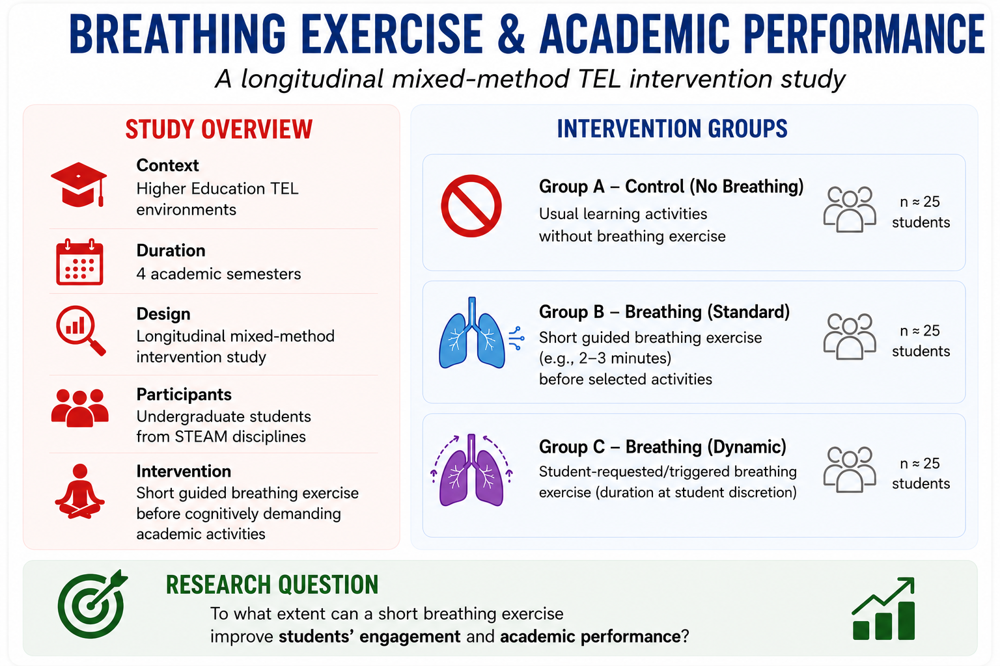

# Breathing Exercise & Academic Performance - A Longitudinal TEL Study

Can a short breathing exercise before academic activities improve students’ focus, wellbeing, engagement, and academic performance over time?

---

# Study Goal

This longitudinal study explores how short guided breathing exercises may influence students’ academic experience in Higher Education.

The activity is also designed to support discussions about:
- longitudinal TEL research
- intervention design
- assessment strategies
- multimodal data
- evidence generation

---

# Study Design

Overview
This workshop uses an artificial longitudinal dataset simulating student behavior over an 4 semesters of university study.
Participants were randomly assigned to the  four different intake groups and repeatedly measured over time.

The dataset was designed for teaching and has these features/details:

- longitudinal data analysis
- repeated measures
- mixed-effects models
- growth trajectories
- multilevel modeling
- visualization of longitudinal trends

---

# Intervention

Students complete a short breathing activity before selected tasks using the controlled breathing exercise:

Possible activities:
- before academic quizzes
- before online academic discussions
- before academic presentations
- before academic exams
- during stressful academic periods

---

# Participants/Experimental Groups

Overview: 
- **Context:** Higher Education  
- **Total participants**: 25 undergraduate students in STEAM domain
- **Study duration**: 4  semesters
- **Design:** Longitudinal mixed-method TEL study  
**Intervention:** Short breathing exercise before selected learning activities
- **Repeated measurements**: twice per week

**Each participant has their own:**
- study habits
- stress patterns
- sleep behavior
- compliance level
- learning trajectory

---

# Experimental groups

| Group | Breathing Intervention |
|---|---|
| Control | No breathing exercise |
| Standard Breathing | 2–3 min guided breathing before selected activities |
| Dynamic Breathing | Student-triggered breathing exercises on demand |

---
# Measurements Collected Fortnightly 

| Variable | Description |
|---|---|
| participant_id | Unique participant identifier |
| measurement_period | Measurement occasion collected every 15 days |
| group | Experimental condition |
| breathing_mode | Type of breathing intervention |
| breathing_duration_min | Duration of breathing activity |
| study_hours | Study hours during the measurement period |
| sleep_hours | Average sleep per night |
| heart_rate | Average heart rate during academic activities |
| blood_pressure | Blood pressure measurements |
| stress_level | Self-reported stress level evaluation |
| engagement_score | Student engagement indicator |
| final_exam_grade | Final academic performance in exams |

---
# Longitudinal Structure

The dataset is organized in long format.

| participant_id | measurement_period | group | final_exam_grade | stress_level | blood_pressure | heart_rate | engagement_score |
|---|---|---|---|---|---|---|---|
| P01 | 1 | Control | 71 | 6 | 122/81 | 84 | 61 |
| P01 | 2 | Control | 73 | 6 | 121/80 | 82 | 63 |
| P01 | 3 | Control | 74 | 5 | 120/79 | 80 | 65 |
| P02 | 1 | Standard Breathing | 78 | 4 | 118/77 | 74 | 75 |
| P02 | 2 | Standard Breathing | 80 | 4 | 117/76 | 72 | 77 |
| P02 | 3 | Standard Breathing | 82 | 3 | 116/75 | 70 | 80 |
| P03 | 1 | Dynamic Breathing | 76 | 5 | 119/78 | 76 | 72 |
| P03 | 2 | Dynamic Breathing | 79 | 4 | 118/77 | 74 | 75 |
| P03 | 3 | Dynamic Breathing | 81 | 3 | 117/76 | 72 | 78 |

Each row represents:
- one participant
- at one measurement occasion
- collected every 15 days
- with one set of physiological, engagement, and academic measurements

Example:
- Participant P01 measured during Period 1
- Participant P01 measured again during Period 2
- Participant P01 measured again during Period 3

---

# Possible Analyses

Participants may explore:

### Statistical Analysis
- descriptive statistics
- group comparisons
- longitudinal trajectories
- mixed-effects models

### Multimodal & Behavioral Analysis
- behavioral sequence analysis
- multimodal learning analytics

### Qualitative Analysis
- thematic analysis
- student reflection analysis
- open-ended response coding

### Visualization
- line plots
- participant/engagement trajectories
- group trends over time

### Longitudinal Modeling

Example mixed-effects model:

\[
AcademicPerformance_{it} = \beta_0 + \beta_1 Time_t + \beta_2 BreathingIntervention_{it} + \beta_3 Engagement_{it} + \beta_4 StressLevel_{it} + u_i + \epsilon_{it}
\]

Where:
- \(AcademicPerformance_{it}\) = academic performance of participant \(i\) at time \(t\)
- \(Time_t\) = measurement occasion
- \(BreathingIntervention_{it}\) = intervention condition
- \(Engagement_{it}\) = engagement score
- \(StressLevel_{it}\) = self-reported stress level
- \(u_i\) = participant-level random effect
- \(\epsilon_{it}\) = residual error

---

# Ethical Considerations

- informed consent
- voluntary participation
- wellbeing-sensitive design
- data anonymization
- ethical handling of longitudinal student data

---

# Workshop Reflection

Imagine your research team has received €4 million in research funding from EATEL to investigate the effects of breathing exercises in Higher Education. **How would you design the study to generate meaningful evidence about students’ learning, engagement, wellbeing, and academic performance over time?**

---

