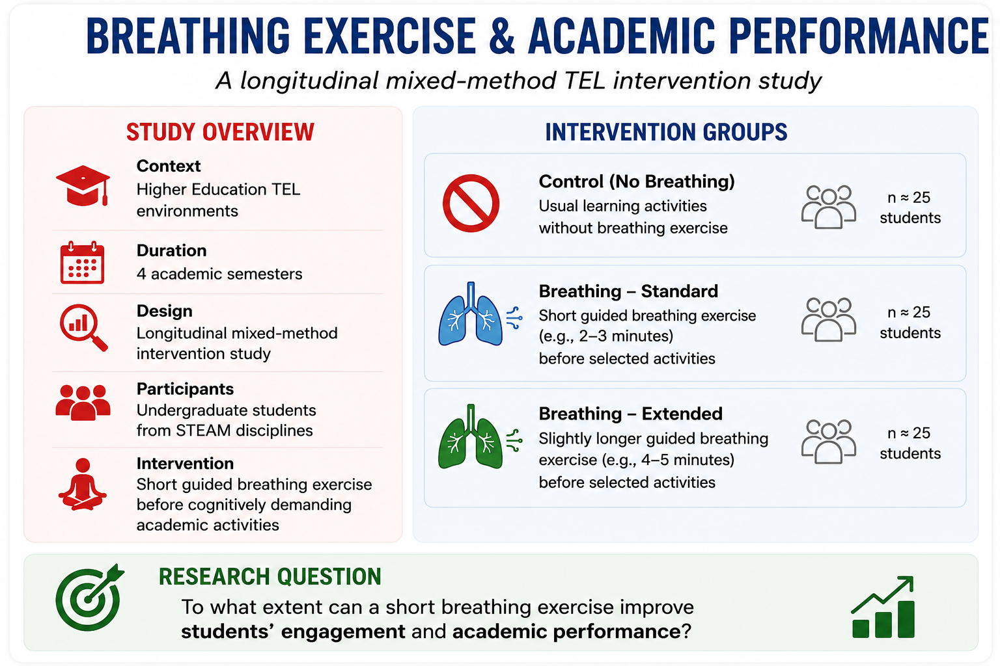

# Breathing Exercise & Academic Performance - A Longitudinal TEL Study

Can a short breathing exercise before academic activities improve students’ focus, wellbeing, engagement, and academic performance over time?

---

# Study Goal

This longitudinal study explores how short guided breathing exercises may influence students’ academic experience in Higher Education.

The activity is also designed to support discussions about:
- longitudinal TEL research
- intervention design
- assessment strategies
- multimodal data
- evidence generation

---

# Study Design

# Overview
This workshop uses an artificial longitudinal dataset simulating student behavior over an 4 semesters of university study.
Participants were randomly assigned to the  four different intake groups and repeatedly measured over time.

The dataset was designed for teaching and has these features/details:

- longitudinal data analysis
- repeated measures
- mixed-effects models
- growth trajectories
- multilevel modeling
- visualization of longitudinal trends

---

# Intervention

Students complete a short breathing activity before selected tasks using the controlled breathing exercise:

Possible activities:
- before academic quizzes
- before online academic discussions
- before academic presentations
- before academic exams
- during stressful academic periods

---

# Participants/Experimental Groups

- **Context:** Higher Education  
- **Total participants**: 25 undergraduate students in STEAM domain
- **Duration:** 4 semesters  
- **Design:** Longitudinal mixed-method TEL study  
**Intervention:** Short breathing exercise before selected learning activities
- **Study duration**: 4  semesters
- **Repeated measurements**: twice per week

**Each participant has their own:**
- study habits
- stress patterns
- sleep behavior
- compliance level
- learning trajectory

---

# Data Collection

<h1 align="center"> elaborate </h1>

---

# Possible Analyses

- longitudinal analysis
- engagement trajectories
- mixed-effects models
- behavioral sequence analysis
- multimodal learning analytics
- thematic analysis

---

# Longitudinal Structure

| Semester | Focus |
|---|---|
| Summer 2025 | Pilot intervention |
| Winter 2025 | Expanded implementation |
| Summer 2026 | Repeated assessments |
| Winter 2026 | Longitudinal comparison |

---

# Ethical Considerations

- informed consent
- voluntary participation
- wellbeing-sensitive design
- data anonymization
- ethical handling of longitudinal student data

---

# Workshop Reflection

Imagine your research team has received €1 million in research funding from EATEL to investigate the effects of breathing exercises in Higher Education. **How would you design the study to generate meaningful evidence about students’ learning, engagement, wellbeing, and academic performance over time?**

---

